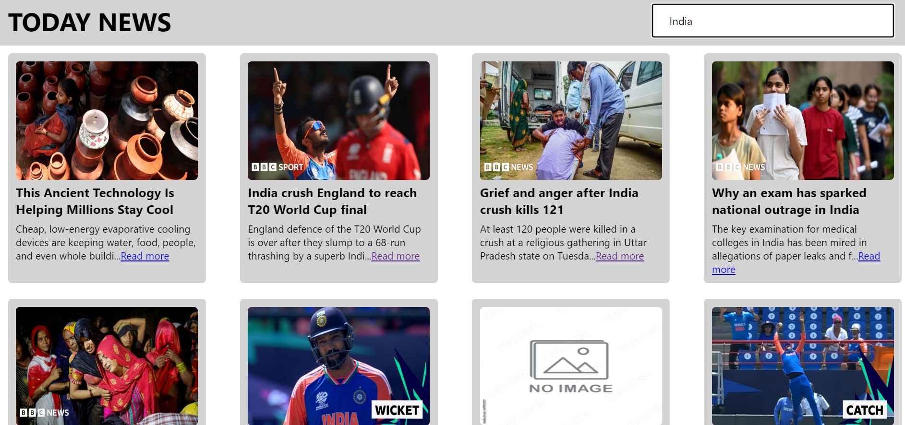

# Today news website 

Project Aim
The objective of this project is to create a dynamic live news website using React. Users can search for news articles in real-time by entering keywords in the input box, and the website will display news articles related to their search terms using a news API.

## Key Features
 * Live News Updates: Display the latest news articles on the homepage, updated in real-time.
 * Search Functionality: An input box where users can enter keywords to search for news articles related to their query.
 * News API Integration: Use a reliable news API to fetch and display news articles based on user input.
 * Responsive Design: Ensure the website is fully responsive and user-friendly across various devices. 

## Skills Required
* React.js
* Html
* Css
* News API

## Result

